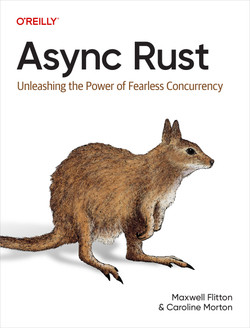

[Buchkritik: Async Rust](https://www.heise.de/tests/Buchkritik-Async-Rust-10484110.html)

```
"Maxwell Flitton und Caroline Morton wenden sich mit ihrem englischsprachigen
Leitfaden an erfahrene Rust-Programmierer, die mit Schlüsselwörtern wie
async/await vertraut sind und auch die Tokio-Bibliothek bereits kennen. Die
Autoren erklären nämlich NICHT etwa, wie man diese Werkzeuge anwendet, sondern
wie diese hinter den Kulissen funktionieren und als Basis für asynchrone
Systeme dienen können."
```
